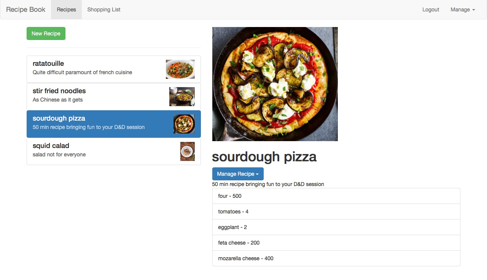
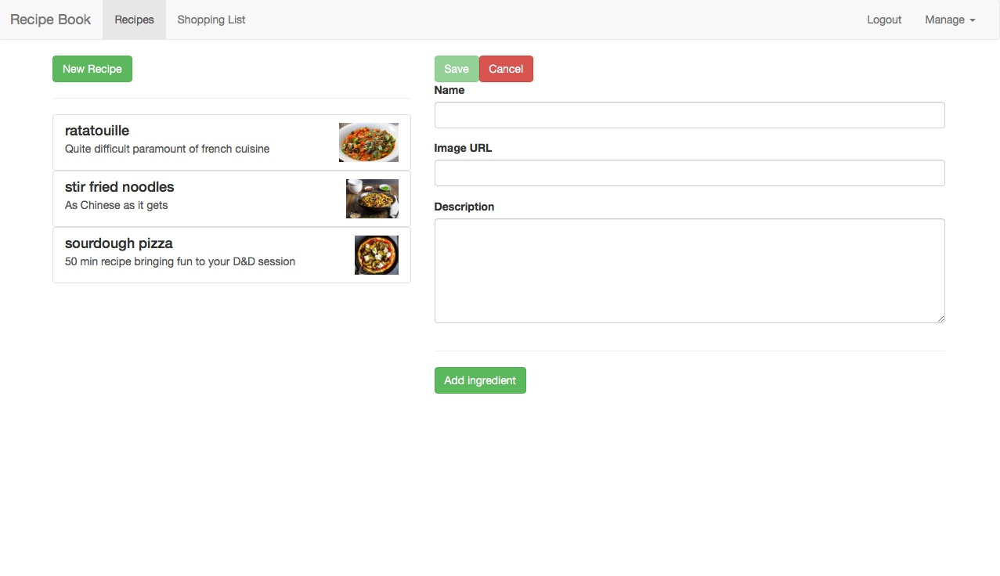
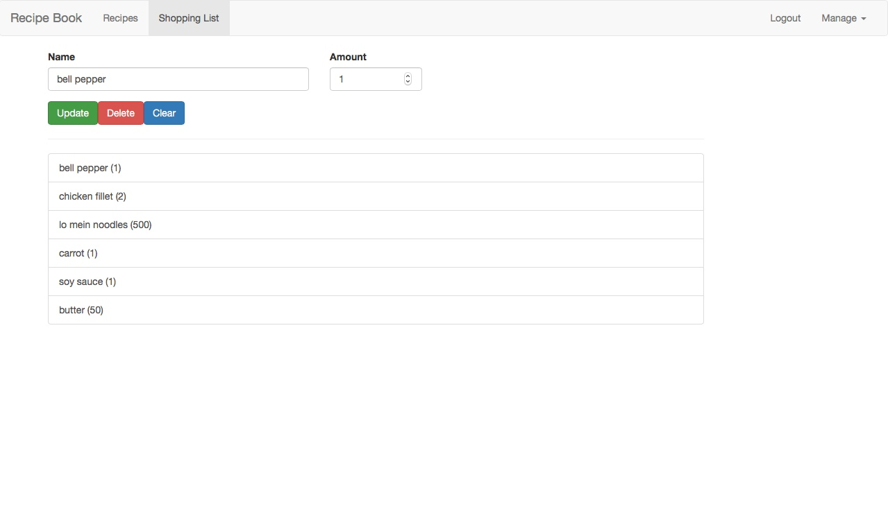
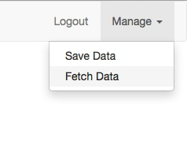
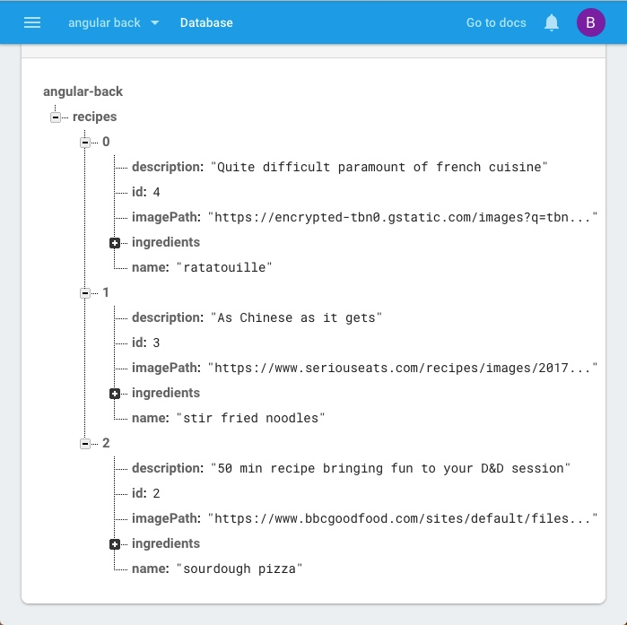

# Recipe book
Сервис для создания и просмотров рецептов

## Технологии
  * Angular
  * Firebase
  * Bootstrap

## Возможности:
 * авторизация(firebase)
 * просмотр и модицикация рецептов
 * создание и удаление рецептов 
 * отправка ингридиентов конкретного рецепта в корзину
 * добавление, удаление и модификация ингридиентов в корзине
 * сохранение и извлечение рецептов(firebase)
 

## Некоторые детали
Создание, модификация и удаление доступны только авторизованным пользователям.

Подгрузка самой тяжёлой страницы с изображениями рецептов производится только по необходимости чтобы ускорить начальную загрузку страницы

На всех формах стоят адекватные валидаторы
## Скриншоты
Просмотр рецептов:

Добавление нового:

Передача ингридиентов рецепта в корзину:

Сохранение и извлечение рецептов на firebase:

 
 

Todo:
* увеличивать ингридиенты пропорционально порциям
* разделить описание на этапы
* добавить секции для видов рецептов

